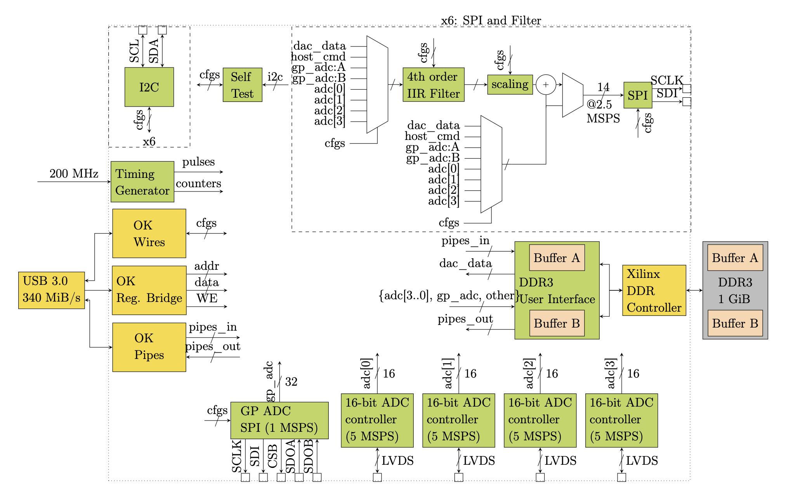

[](https://zenodo.org/doi/10.5281/zenodo.12745954)

Verilog and Python for a general purpose data acquisition system using an OpalKelly FPGA as the main controller. The Python is designed to be a general purpose approach to interface with multiple peripheral components that contain register maps. 


# Quick Start 
## System installation
### Installing dependencies
#### Anaconda

Download Anaconda from this [link](https://www.anaconda.com/download/success) according to your computer system (Mac, Windows, Linux,...). Double-click the `pkg` file you just downloaded and follow along with the instructions popping up to get Anaconda installed. From now on we will type scripts in Anaconda Prompts, so make sure to open the Anaconda Prompts terminal after the installation process!

In the Anaconda Prompts terminal, please check your Python version:

```sh
python --version
```
Please make sure the python version you are using is 3.9 or above.

#### Opal Kelly

This project requires users to have already subscribed to Opal Kelly. In this [link provided here](https://pins.opalkelly.com/), please log in with your Opal Kelly account (or perhaps create a new account if you did not happen to have one - a little disclaimer - they wouldn't allow any email with "@gmail.com" domain, so you may need your corporation email to register). Once you get into your account dashboard, let's click onto "File Downloads" and install the Driver `FrontPanelUSB-DriverOnly-5.X.Y.exe` file. In your File Explorer, double-click onto that `.exe` file to get their installation instruction.

#### National Instruments VISA (NI-VISA)

This allows the codebase to communicate with lab instruments like power supplies and oscilloscopes. Users need to install NI-VISA from [National Instruments](https://www.ni.com/en/support/downloads/drivers/download.ni-visa.html?srsltid=AfmBOoovcFQiQMx4IjaNkg-Cd8_ZoBqP2IjF_Lhh3Y8K0nGonVGv8YZC#565016). Log in with your account or create a new account if you haven't had one yet, and then click download to get their `.exe` file. Double-click on it to follow along with their installation instruction.

### Navigating and minimal scripting to install lab systems

These following steps require users to script in the Anaconda Prompts terminal.

#### Clone the covg_fpga repository

Clone the covg_fpga repository with github. This provides the required FPGA bitfile and test code.

```sh
git clone --recursive https://github.com/lucask07/covg_fpga
```

#### Navigate to `installation_scripts` directory

As the first step, make sure you are in the `covg-fpga` directory. If not, type:

```sh
cd covg-fpga
```
Then go to the directory for the system installation scripts:

```sh
cd installation_scripts
```

> [!NOTE]
> For these following steps, should you ever encounter this warning as shown below, you can just ignore it:
> ```
> Error:  <class 'ImportError'>
> IC (integrated circuit imports failed)
> The aardvark.so or dll must be in the cwd or an importable path
> Continuing anyways, since many may not use this portion...
> ```

#### Open ipython interactive terminal and start system installation

First, activate the python interpreter:

```sh
ipython
```
Then, copy and paste this scripts to get the lab system installed:

```py
import system_installation
system_installation.system_install()
```
Make sure to check the output and `log.txt` to track the installation process to get an even more solid idea of what's going on during the installation and if it has been successful. The `log.txt` file will be generated by the above function call.

To give you more information about what that function does, it will automatically install all dependencies including python packages, and perform some initial set up for the covg-fpga lab environment. Now the next step is to register lab instruments to the configuration yaml file.

> [!NOTE]
> The scripts provided intend to do multiple small tasks under the hood to get the system installed, including PyPI packages' installation, whose progress is illustrated with a progress bar in the terminal. Please note that it only visualizes the progress of PyPI packages' installation but not for the whole installation procedure!

#### Lab instruments registration

After the installation, you still need to specify what lab instrument(s) you will be using into a yaml configuration file. Luckily, this process can be finished with just a function call. Type this into your ipython terminal:

```python
import add_instruments
add_instruments.add_instrument()
```

Make sure to only connect your instruments one by one if you happen to work with multiple instruments. With each instrument connected, perform that function call and unplug the instrument when the function call is finished. This helps eliminate any ambiguity since the function call only gives the caller the address (visa), not the name of the instrument.

When it asks for the path to point your class of instrument to, please choose the right one because the path points to the `csv` file recording important information for each particular instrument class. They are both inside of the `instrbuilder` Python site-package, which has been installed to your computer with [this function call](#open-ipython-interactive-terminal-and-start-system-installation). The important folder structures you need to know look like:

```
instrbuilder
|__ instruments
        |__ agilent __ function_gen __ 3320A
        |__ gwinstek __ lcr __lcr6300
        |__ keysight
        |       |__ function_gen __ 33500B
        |       |__ multimeter __ 34465A
        |       |__ network_analyzer __ N5221A
        |       |__ oscilloscope __ MSOX3000
        |__ rigol
        |   |__ oscilloscope __ xs1000
        |   |__ supply __ DP832
        |__ srs __ lock_in __ sr810
        |__ tester
```

When specifying the path, only start from the folder that is the child of `instruments`. Do not include `instruments` or `instrbuilder` themselves. For example, if you are connecting your computer with an instrument that is tagged as "Rigol" and "Oscilloscope", your path should be `rigol/oscilloscope/xs1000`.

**For now, you have finished the fundamental installation and set-up for lab instruments for the experiments!**

### Debugging

After the installation, you will likely see the `log.txt` file. When the installation is normal, your `log.txt` should look like:

```txt
SUCCESS: Python verification SUCCESS -- python version 3.9 or above 
Start installing pip from requirements.txt 
Package numpy==1.26.4 installed successfully!
Package numfi installed successfully!
Package matplotlib installed successfully!
Package pandas installed successfully!
Package numexpr>=2.8.4 installed successfully!
Package bottleneck>=1.3.6 installed successfully!
Package openpyxl installed successfully!
Package pyvisa installed successfully!
Package git+https://github.com/lucask07/instrbuilder@714d18d0a5d2dbcb2b1d8df46cb5673e67b10d64 installed successfully!
Package ltspice installed successfully!
Package h5py installed successfully!
Package ipython installed successfully!
Package jupyter installed successfully!
Package pytest installed successfully!
Package pyqt5==5.15.11 installed successfully!
Package pyyaml installed successfully!
Package torch installed successfully!
Package control installed successfully!
Package torch installed successfully!
Package torch-cubic-spline-grids installed successfully!
Package pyripherals @ git+https://github.com/lucask07/pyripherals installed successfully!
Package torchaudio installed successfully!
Package torchsummary installed successfully!
Package tensorboard installed successfully!
Package lmfit installed successfully!
Finished installing pip 
Start installing Registers.xlsx 
Finished installing Registers.xlsx 
Writing ~\.pyripherals\config.yml 
Finding the path of the Opal Kelly API 
Done finding the path to Opal Kelly - The path is: C:\Program Files\Opal Kelly\FrontPanelUSB 
Finished writing .pyripherals\config.yml 
Initiate the config_yaml for the instrbuilder module 
Done initiating instrbuilder's config_yaml 
Configuration finished 
```

If there is anything that seems a little bit off, there may be a sign that your installation flow has broken somewhere. In the meantime, please look at the terminal output to get a clearer idea of what's going on during your installation. _The purpose of log file is to provide us with information when you open an issue on this repository_.

### Additional installation reference:

See [Installation Guide](https://pyripherals.readthedocs.io/en/latest/installation.html) for more information. Additionally, please review [`instrbuilder`'s installation guide](https://lucask07.github.io/instrbuilder/build/html/installation.html) for setting up the electrical engineering lab instruments.

## Experiment Manual
Please visit [experiment_manual.md](installation_scripts/experiment_manual.md) for details about experiment manuals.

# Acknowledgements 

If this work contributes to your research please cite:

I. Delgadillo Bonequi, A. Stroschein, and L. J. Koerner, “A field-programmable gate array (FPGA)-based data acquisition system for closed-loop experiments,” Review of Scientific Instruments, vol. 93, no. 11, p. 114712, Nov. 2022, [doi: 10.1063/5.0121898](http://doi.org/10.1063/5.0121898).

A. Stroschein, I. D. Bonequi, and L. J. Koerner, “Pyripherals: A Python Package for Communicating with Peripheral Electronic Devices,” Journal of Open Source Software, vol. 7, no. 79, p. 4762, Nov. 2022, [doi: 10.21105/joss.04762](http://doi.org/10.21105/joss.04762).

This work is partially supported by National Institutes of Health (NIH) R15 grant R15NS116907 to PI L. J. Koerner.

Research reported in this repository was supported by the National Institute Of Neurological Disorders And Stroke of the National Institutes of Health under Award Number R15NS116907. The content is solely the responsibility of the authors and does not necessarily represent the official views of the National Institutes of Health.

## The FPGA code is dervied from many open-source contributions. 

* The I2C controller is from OpalKelly [OpalKelly I2CController](https://github.com/opalkelly-opensource/design-resources/tree/main/HDLComponents/I2CController) (MIT License).

* The AD7961 controller is from Analog Devices and is free to use / redistribute as long as its used with Analog Devices parts (which must be the case since it does not work if connected to other parts). The Verilog is available within the [EVAL-AD7960 evaluation kit software](https://www.analog.com/en/design-center/evaluation-hardware-and-software/evaluation-boards-kits/eval-ad7960.html#eb-overview)

* The [SPI Controller](http://www.opencores.org/projects/spi/) is from OpenCores.org and is authored by Simon Srot (GPL 2.1 or later license). 

* The wishbone master is written by Dan Gisselquist, Gisselquist Technology LLC. (LGPL, v3) 

* The DDR user interface (ddr_test.v) started with the OpalKelly DDR example provided in the FrontPanel example RAMTester and was significantly modified to support two ports.

## The Python code relies on wonderful open source packages such as:

* Matplotlib 
* numpy
* pandas


# OpalKelly Module Compatibility. 
We have targeted and tested with the [XEM7310-A75 module](https://opalkelly.com/products/xem7310/) (Xilinx Artix-7). We have not tested but anticipate reasonable portability to other USB 3 OpalKelly modules including:

* XEM7310MT
* XEM7320
* XEM7305
* XEM7360

# FPGA Block Diagram (Approximate)
<p align="center">

