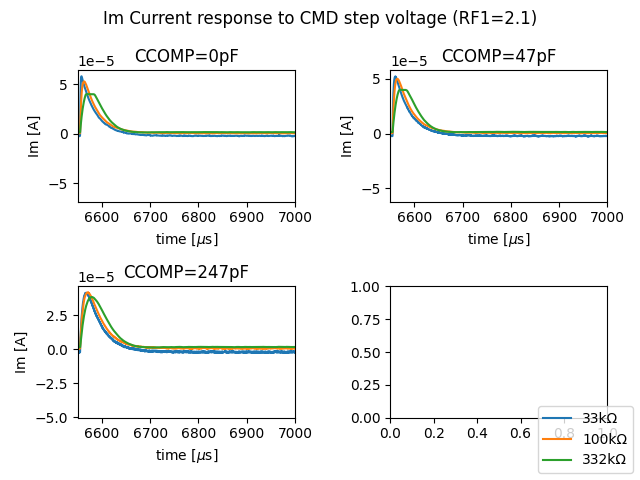
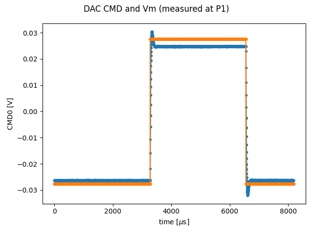

This README demonstrates quick start tests and the results of these tests. 

## To Run  

Questions: power supply? 

Setup 

## Results 

Calibration results are available here:
[calibration results](calibration.csv)

## Open Loop Tests

### Current step response 
<!--- from test .py --->

### Membrane voltage step response 

### Step Response Summary Metrics  

- Im noise 
- Vm rise time 
- Vm amplitude 

### CC Electrode Impulse Responses 
<!--- from test xyz.py --->

## Closed Loop Tests

### System Health Parameters 

Other parameters from these tests are recorded such as the power supply current, the FPGA bit-file MD5 checksum, timestamp, USB transfer rates, and environmental variables. This data supports debug and health checks. 

[other system parameters](system_params.csv)